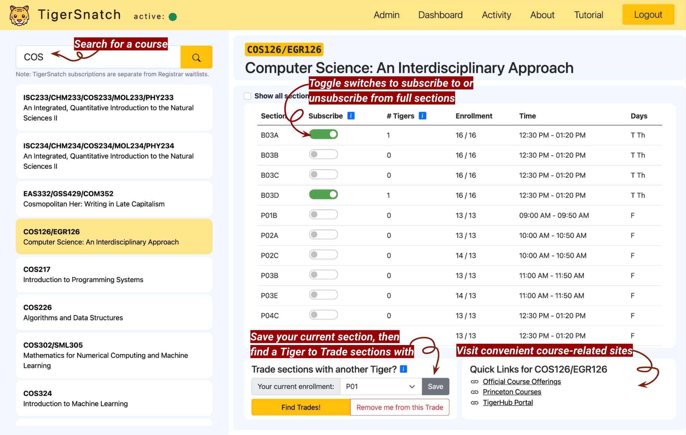
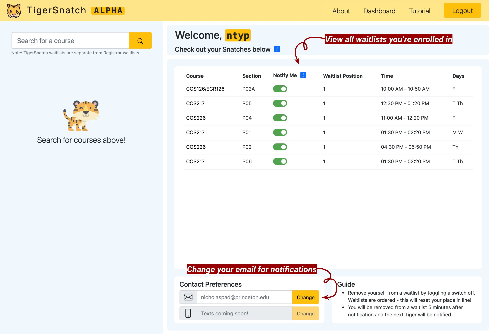
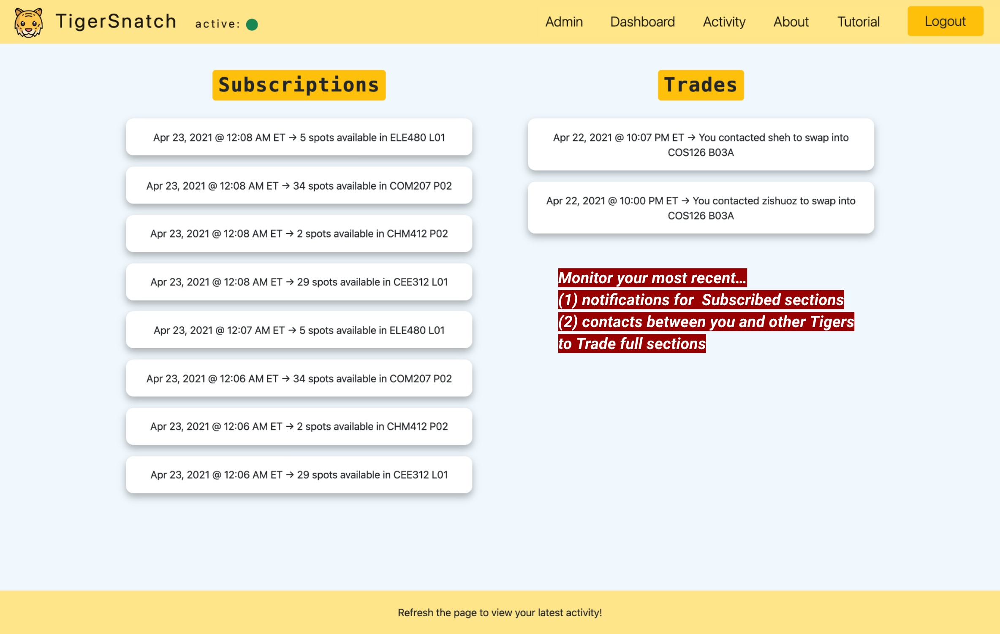

# Welcome to TigerSnatch!

[TigerSnatch](https://snatch.tigerapps.org) helps Princeton students with course enrollment through its Subscriptions and Trades features. With Subscriptions, students can get notified via email when a full class opens up, alleviating the need to repeatedly check official Course Offerings. TigerSnatch Trades, a first-of-its-kind system at Princeton, finds and facilitates swaps between students who wish to enroll in each other's full sections.

> TigerSnatch was built in Spring 2021 by Shannon Heh '23, Nicholas Padmanabhan '23, and Byron Zhang '23 as a project for COS333 at Princeton University. TigerSnatch is now maintained by Princeton USG as a [TigerApp](https://www.tigerapps.org/). Check out the TigerSnatch documentation in `docs/`!
> 
---

    

        

            Before you start Snatching for course spots, here’s a brief guide on how to use
            TigerSnatch.
        

    

    

        

            Search for a course by course department, number, or title.
        

    

    

        

            Toggle “Subscribe” switches to subscribe to (i.e. receive notifications for) or
            unsubscribe from (i.e. stop receiving notifications for) full sections.
        

    

    

        

            If you're already enrolled in a full section but wish to switch into another,
            try out Trades. From the dropdown, select and save your currently enrolled
            section. Then, click Find Trades to view and email other Tigers who are in one
            of your subscribed sections and want to switch into your current section.
        

    

     
    

        

            
        

    

     
    

        

            Return to the dashboard to check out your subscriptions (i.e. "Snatches") and
            the sections you wish to trade with other Tigers.  
        

    

     
    

        

            
        

    

     
    

        

            It's that simple! The next time a spot opens up in a subscribed section, you'll
            be notified immediately via email. You will continue receiving notifications
            every 2 minutes until this section is full again, or you unsubscribe from it. To
            unsubscribe from a particular section, simply log back onto TigerSnatch and
            toggle the section's switch off in the Dashboard.
        

    

    

        

            By the way, every time a notification is sent for a newly available subscribed
            section or you and another Tiger choose to contact one another to engage in a
            Trade, these actions will be logged on the Activity page for your covenience.
        

    

     
    

        

            
        

    

     

<link href="https://cdn.jsdelivr.net/npm/bootstrap@5.0.0-beta3/dist/css/bootstrap.min.css" rel="stylesheet" integrity="sha384-eOJMYsd53ii+scO/bJGFsiCZc+5NDVN2yr8+0RDqr0Ql0h+rP48ckxlpbzKgwra6" crossorigin="anonymous" />
<link rel="stylesheet" type="text/css" href="static/styles.min.css" />

_TigerSnatch subscriptions are independent from official Registrar waitlists. You
might not be able to enroll in courses shown on TigerSnatch even if spots free
up. Always check Course Offerings for course-specific enrollment info._
